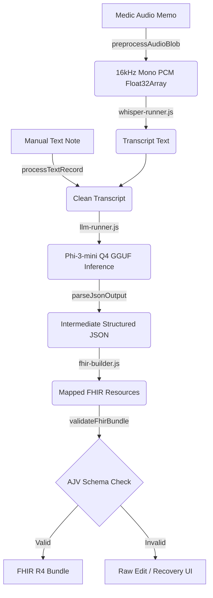

# MedicAssist — System Architecture

MedicAssist is an offline-first, CPU-only medical data transcription and structured clinical record extraction system. It processes unstructured audio or text inputs and converts them into standardized, validated FHIR R4 clinical resources in a Progressive Web App (PWA) environment.

---

## 1. High-Level Data Flow

The diagram below represents the sequential transformation of raw inputs into a validated clinical data bundle.

---

## 2. Component Design & Roles

The system is split into four primary JavaScript modules, which run inside the browser context of the PWA.

### 2.1 Orchestrator (`ai-pipeline.js`)
* **Role**: Orchestrates the entire pipeline, coordinating progress notifications and data flow.
* **API**: 
  - `processAudioRecord(audioBlob, onProgress)`: Triggers audio preprocessing, Whisper transcription, Phi-3 data extraction, FHIR mapping, and validation.
  - `processTextRecord(text, onProgress)`: Skips transcription, executing the downstream pipeline directly.
  - `preloadModels(onProgress)`: Pre-fetches and initialises the speech and language models during browser idle time.
* **Progress Tracking**: Allocates weight budgets to stages (Transcribe: 40%, Extract: 45%, Build: 10%, Validate: 5%) to show a smooth, unified progress bar in the UI.

### 2.2 Speech-to-Text Engine (`whisper-runner.js`)
* **Role**: Decodes, downsamples, and transcribes voice recordings fully offline.
* **Audio Preprocessing**: Uses the Web Audio API's `OfflineAudioContext` to decode standard audio formats (WebM/WAV) and downsample them to the 16kHz mono PCM Float32Array required by Whisper.
* **Inference**: Executes a WASM-compiled build of `whisper.cpp` loaded with a 150MB `ggml-small.en.bin` speech model cached locally.

### 2.3 Clinical NLP Parser (`llm-runner.js`)
* **Role**: Extracts structured patient, triage, and condition data from raw text notes.
* **Inference**: Runs a WASM compilation of `llama.cpp` using the Microsoft Phi-3-mini-4k-instruct-q4 GGUF model (~2.2 GB).
* **Prompt Engineering**: Wraps input text with a system prompt specifying the target JSON schema and two few-shot context examples.
* **Early Stop Strategy**: Tracks generated token streams. Once a matched opening and closing braces depth of 0 is detected after the initial `{`, generation is actively aborted to conserve CPU cycles.
* **Robust Parsing**: If the LLM includes prose, the parser isolates the first balanced `{ ... }` block. It also handles basic type coercions (e.g. converting age strings to integers) and initializes missing fields to empty lists or nulls.

### 2.4 FHIR Builder & Validator (`fhir-builder.js`)
* **Role**: Maps intermediate JSON to compliant FHIR R4 schema objects and validates them.
* **Resource Mapping**:
  - `Patient`: Maps gender and age (including birth year extrapolation).
  - `Encounter`: Maps triage severity level, location, and timestamps.
  - `Condition`: Maps injuries, body sites, and severity codes.
  - `Observation`: Maps clinical vitals (e.g., blood pressure, heart rate) using LOINC codes.
  - `Procedure`: Maps treatments, times, and execution status.
* **Validation Layer**: Lazily loads AJV (Another JSON Schema Validator) and validates the bundle against `spec/fhir-schema.json`.
* **Resilient Fallback**: If AJV fails to load (e.g., first run offline without CDN cache), a minimal structural `smokeValidate` check checks for the presence of mandatory properties and resource types (Patient, Encounter, Condition) before allowing local saving.

---

## 3. Offline & Memory Design

* **Resource Caching**: The PWA Service Worker (`sw.js`) caches the application shell, WASM binaries (`whisper.js`, `llama.js`), and model binaries (`ggml-small.en.bin` and `phi-3-mini-4k-instruct-q4.gguf`) in browser cache storage.
* **Offline Fetching**: Model loadings use standard `fetch()` API calls against same-origin resources, transparently intercepted by the Service Worker.
* **Storage**: Output bundles are persisted in browser IndexedDB (facilitated by `db.js`), remaining safe across page reloads and browser closures.
* **Memory Management**: Models are warmed up once on idle and cached in-memory. They are reused for subsequent records to eliminate model loading overhead.
